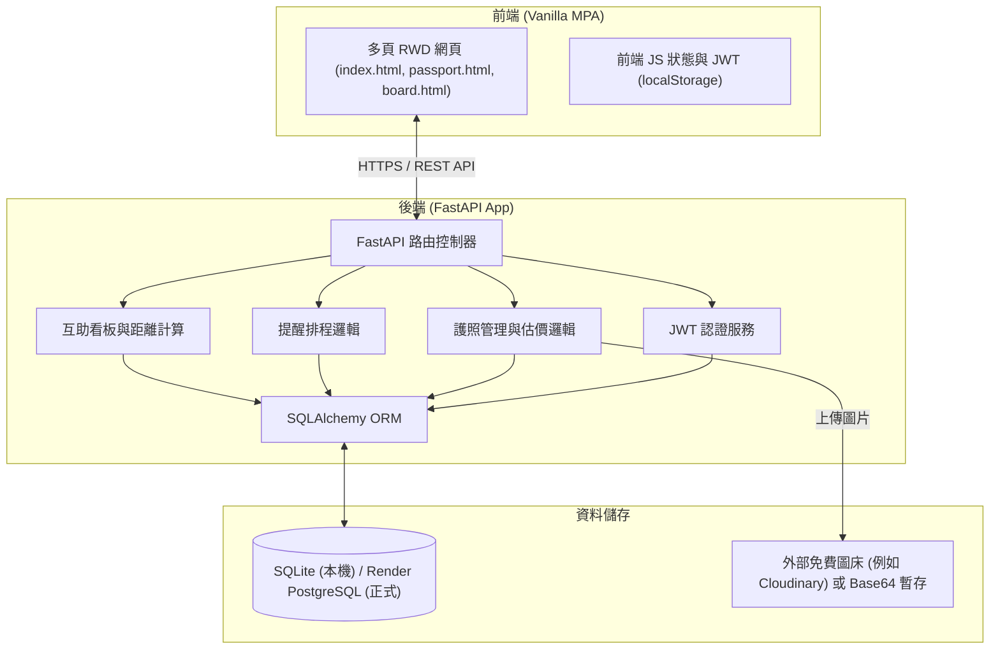
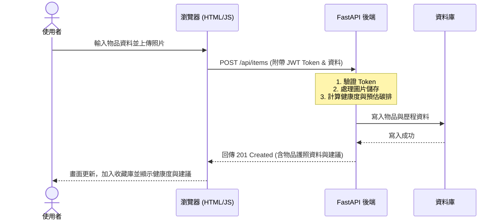
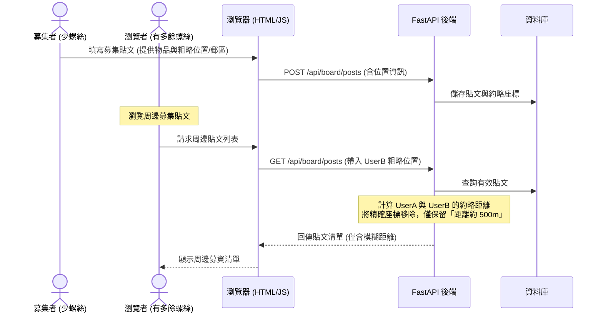

# 綠色循環經濟護照 (Green Cycle Passport) 系統架構設計文件

## 1. 系統架構 (System Architecture)
本系統採用前後端分離的 **Client-Server (前後端分離)** 架構，並在正式部署時進行整合優化，以適應 Render.com 免費方案的限制。

### 架構說明：
- **前端**：純多頁 HTML/CSS/JS 網頁，每個頁面為獨立的 `.html` 檔案，方便使用者自訂與修改。
- **後端**：FastAPI 提供高效能、自動生成 OpenAPI 文件的 REST API。
- **單一服務部署（Render 免費方案優化）**：
  後端 FastAPI 直接透過 `StaticFiles` 託管 `frontend/` 目錄。在本地開發與部署生產環境時，只需要啟動一個後端服務，便能同步載入前端靜態網頁並進行 API 呼叫，完全解決了跨域（CORS）限制與雙伺服器冷啟動延遲的問題。

## 2. 核心模組職責 (Core Module Responsibilities)
- **會員模組 (Auth Module)**：
  - 職責：使用者註冊、登入、密碼雜湊加密、JWT Token 發行與驗證。
- **物品護照模組 (Passport Module)**：
  - 職責：物品檔案的增刪查改（CRUD）、照片處理、健康度初估、根據材質與壽命計算大略碳排，並提供綠色循環建議（如二手估價、捐贈管道推薦）。
- **保養提醒模組 (Reminder Module)**：
  - 職責：設定保養週期、計算下次提醒時間、於系統內或 API 被觸發時發送提醒訊息。
- **互助看板模組 (Community Board Module)**：
  - 職責：發布零件募集貼文、查詢周邊募集需求、模糊化距離計算（不透露精確位置）。

## 3. 資料流 (Data Flow)
### 物品護照建立與健康度評估資料流

### 微型零件募集與距離顯示資料流

## 4. 資料庫設計建議 (Database Design Recommendations)
本系統使用通用關係型資料庫設計，以便於在 SQLite (開發) 與 PostgreSQL (生產) 間無縫轉移。

### 核心實體關聯：
- `User` (1) <---> (N) `ItemPassport`
- `User` (1) <---> (N) `CommunityPost`
- `ItemPassport` (1) <---> (N) `MaintenanceRecord` (維修紀錄)

*詳細資料表 Schema 設計將於 `data-model.md` 中定義。*

## 5. API 設計建議 (API Design Recommendations)
採用 RESTful API 設計，所有需認證之端點皆須於 Header 帶入 `Authorization: Bearer <JWT_TOKEN>`。

- **認證相關 (Authentication)**:
  - `POST /api/auth/register` : 註冊新帳戶
  - `POST /api/auth/login` : 登入並取得 Token
- **物品護照 (Item Passport)**:
  - `GET /api/items` : 取得目前使用者的所有物品
  - `POST /api/items` : 建立新物品護照
  - `GET /api/items/{id}` : 取得特定物品詳細資料（含循環建議）
  - `PUT /api/items/{id}` : 修改物品資料或新增維修紀錄
  - `DELETE /api/items/{id}` : 刪除物品護照
- **互助看板 (Community Board)**:
  - `GET /api/board/posts` : 查詢周邊募集貼文（需帶入目前定位或郵區）
  - `POST /api/board/posts` : 發布零件募集貼文
  - `DELETE /api/board/posts/{id}` : 關閉或刪除貼文

## 6. 技術選型 (Technology Selection)
- **前端開發**：純 HTML5 + CSS3 (響應式手寫，無 Tailwind/React，最適合使用者隨時打開編輯) + Vanilla JavaScript (原生的 ES6 Fetch API 串接)。
- **後端框架**：FastAPI (Python 3.10+)，具備極佳的效能，並與 Python 生態高度整合。
- **資料庫 ORM**：SQLAlchemy + Alembic (資料庫遷移工具)，確保開發環境 SQLite 與生產環境 PostgreSQL 的 Schema 同步。
- **安全認證**：PyJWT (JSON Web Token) + Passlib (bcrypt 密碼雜湊)。

## 7. 安全性 (Security)
- **憑證與機密保護**：禁止將任何 Key（如 JWT Secret）寫在代碼中，必須透過環境變數傳遞。本地使用 `.env`，生產環境於 Render 控制台設定。
- **敏感資料加密**：密碼在寫入資料庫前必須使用 `bcrypt` 進行單向雜湊。
- **隱私防護 (位置模糊化)**：
  - 系統不得直接向其他使用者公開發文者的精確經緯度或地址。
  - 僅在後端計算兩點距離，API 輸出的欄位僅包含模糊化的距離描述（如「500公尺內」、「1公里內」），防止透過看板推導出使用者住址。

## 8. 部署方式 (Deployment & Infrastructure)
- **平台選型**：Render.com (免費 Web Service 方案)。
- **資料庫**：Render PostgreSQL (免費方案)。
- **部署流程**：
  - 前端與後端合併在一個 Git 目錄中。
  - FastAPI 使用 `StaticFiles` 掛載 `./frontend` 資料夾。
  - Git Push 至 GitHub 後，觸發 Render.com 自動部署。不需要安裝 npm 依賴或在雲端執行 build 命令，啟動迅速。

## 9. 待確認事項 (Pending Clarifications)
以下為需求規格中尚未明確，且可能影響架構的技術決策：
1. **物品相片儲存方案**：
   - Render 免費 Web Service 的磁碟為 Ephemeral (暫時性)，每次重啟部署，使用者上傳的物品相片會消失。
   - *目前設定*：Demo 階段採用**將圖片轉成 Base64 格式存入資料庫**，且限制上傳圖片大小在 500KB 以下。
2. **保養提醒的主動通知機制**：
   - Render 免費伺服器會自動休眠，休眠期間後端無法主動發送通知。
   - *目前設定*：Demo 階段採用**「當使用者登入或打開網頁時，在前端畫面跳出即期物品提醒」**，免去外部 Cron-job 的整合。
3. **距離計算的位置來源**：
   - *目前設定*：使用者註冊或發布募集貼文時，使用**瀏覽器 GPS 取得約略定位**（精確度模糊到小數點後 2 位），後端計算 Haversine 距離。
