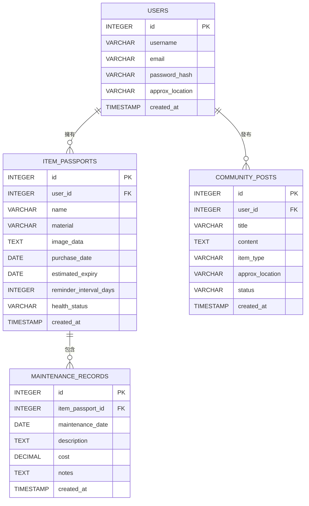

# 綠色循環經濟護照 (Green Cycle Passport) 資料模型設計文件

## 1. 實體關係圖 (Entity Relationship Diagram)
本系統使用通用關係型資料庫設計，描述使用者、物品護照、維修紀錄與互助貼文之間的關聯。

## 2. 核心實體與欄位設計 (Core Entities & Fields)

### 2.1 使用者資料表 (USERS)
| 欄位名稱 (Field) | SQL 資料型別 (SQL Type) | 主鍵/外鍵 (PK/FK) | 允許空值 (Null?) | 預設值 (Default) | 說明與業務邏輯 (Description) |
| :--- | :--- | :--- | :--- | :--- | :--- |
| id | INTEGER | PK | NO | (AUTOINCREMENT) | 使用者唯一識別碼 |
| username | VARCHAR(50) | - | NO | - | 使用者帳號，具唯一性 (Unique) |
| email | VARCHAR(100) | - | NO | - | 使用者電子信箱，具唯一性 (Unique)，用於登入 |
| password_hash | VARCHAR(255) | - | NO | - | 加密後的密碼 (bcrypt 雜湊值) |
| approx_location | VARCHAR(100) | - | YES | NULL | 使用者約略位置資訊（例如郵遞區號或粗略區域，用於隱私距離計算） |
| created_at | TIMESTAMP | - | NO | CURRENT_TIMESTAMP | 帳號建立時間 |

### 2.2 物品護照資料表 (ITEM_PASSPORTS)
| 欄位名稱 (Field) | SQL 資料型別 (SQL Type) | 主鍵/外鍵 (PK/FK) | 允許空值 (Null?) | 預設值 (Default) | 說明與業務邏輯 (Description) |
| :--- | :--- | :--- | :--- | :--- | :--- |
| id | INTEGER | PK | NO | (AUTOINCREMENT) | 物品護照唯一識別碼 |
| user_id | INTEGER | FK | NO | - | 關聯至 `USERS(id)`，表示擁有者 |
| name | VARCHAR(100) | - | NO | - | 物品名稱（例如：實木靠背椅） |
| material | VARCHAR(100) | - | YES | NULL | 物品主要材質（例如：木質、塑料、金屬） |
| image_data | TEXT | - | YES | NULL | 物品照片。Demo 階段前端讀取檔案轉 Base64 字串後直接存入 |
| purchase_date | DATE | - | NO | - | 購買日期 |
| estimated_expiry | DATE | - | NO | - | 預估使用壽命（到期日期） |
| reminder_interval_days | INTEGER | - | NO | 30 | 定期保養提醒週期（天數） |
| health_status | VARCHAR(20) | - | NO | 'Good' | 物品健康度（如：Good/Fair/Needs Repair/Recycled/Donated） |
| created_at | TIMESTAMP | - | NO | CURRENT_TIMESTAMP | 護照建立時間 |

### 2.3 維修紀錄資料表 (MAINTENANCE_RECORDS)
| 欄位名稱 (Field) | SQL 資料型別 (SQL Type) | 主鍵/外鍵 (PK/FK) | 允許空值 (Null?) | 預設值 (Default) | 說明與業務邏輯 (Description) |
| :--- | :--- | :--- | :--- | :--- | :--- |
| id | INTEGER | PK | NO | (AUTOINCREMENT) | 維修紀錄唯一識別碼 |
| item_passport_id | INTEGER | FK | NO | - | 關聯至 `ITEM_PASSPORTS(id)` |
| maintenance_date | DATE | - | NO | - | 維修保養日期 |
| description | TEXT | - | NO | - | 維修保養內容說明（例如：鎖緊底部螺絲、表面重新上漆） |
| cost | DECIMAL(10,2) | - | NO | 0.00 | 維修花費金額 |
| notes | TEXT | - | YES | NULL | 其他備註說明 |
| created_at | TIMESTAMP | - | NO | CURRENT_TIMESTAMP | 紀錄建立時間 |

### 2.4 社群互助貼文資料表 (COMMUNITY_POSTS)
| 欄位名稱 (Field) | SQL 資料型別 (SQL Type) | 主鍵/外鍵 (PK/FK) | 允許空值 (Null?) | 預設值 (Default) | 說明與業務邏輯 (Description) |
| :--- | :--- | :--- | :--- | :--- | :--- |
| id | INTEGER | PK | NO | (AUTOINCREMENT) | 貼文唯一識別碼 |
| user_id | INTEGER | FK | NO | - | 關聯至 `USERS(id)`，表示發布者 |
| title | VARCHAR(150) | - | NO | - | 募集貼文標題（例如：徵求一顆 M6 螺絲修椅子） |
| content | TEXT | - | NO | - | 募集詳細說明 |
| item_type | VARCHAR(50) | - | YES | NULL | 零件/物品類別（輔助分類篩選） |
| approx_location | VARCHAR(100) | - | YES | NULL | 發文時的粗略位置（若與使用者註冊位置不同） |
| status | VARCHAR(20) | - | NO | 'Open' | 貼文狀態（Open: 募集中, Closed: 已徵得/結束） |
| created_at | TIMESTAMP | - | NO | CURRENT_TIMESTAMP | 貼文建立時間 |

## 3. 資料驗證規則 (Data Validation Rules)
- **Email 格式**：`USERS(email)` 必須符合標準電子信箱格式，且於寫入前轉為小寫。
- **密碼強度**：註冊時密碼長度必須至少 8 位元組。
- **日期邏輯**：
  - `ITEM_PASSPORTS(purchase_date)` 不得晚於當前日期。
  - `ITEM_PASSPORTS(estimated_expiry)` 必須晚於 `purchase_date`。
  - `MAINTENANCE_RECORDS(maintenance_date)` 不得晚於當前日期。
- **數值範圍**：
  - `reminder_interval_days` 必須大於 0。
  - `cost` 必須大於或等於 0.00。
- **狀態枚舉限制**：
  - `health_status` 限制為: `Good`, `Fair`, `Needs Repair`, `Recycled`, `Donated`, `Sold`。
  - `status` 限制為: `Open`, `Closed`。

## 4. 索引建議 (Index Recommendations)
為了在頻繁查詢的欄位上提升效能（尤其是在生產環境 PostgreSQL 中）：
- **Unique Index**:
  - `idx_users_email` ON `USERS(email)`：加速登入查詢與確保唯一。
  - `idx_users_username` ON `USERS(username)`：確保帳號唯一。
- **Foreign Key Index** (加速關聯查詢):
  - `idx_item_passports_user_id` ON `ITEM_PASSPORTS(user_id)`：取得使用者收藏庫。
  - `idx_maintenance_records_item_id` ON `MAINTENANCE_RECORDS(item_passport_id)`：取得物品的維修歷史。
  - `idx_community_posts_user_id` ON `COMMUNITY_POSTS(user_id)`：取得使用者發布的貼文。

## 5. 資料生命週期 (Data Lifecycle)
- **使用者與物品護照**：
  - 考量循環經濟的紀錄完整性，當使用者刪除物品時，系統不執行實體刪除（Hard Delete），而是將 `health_status` 修改為對應的狀態（如 `Recycled` / `Donated` / `Sold`），並解除在收藏庫的主畫面呈現。這可供未來第二階段統計年度 ESG 成果。
- **互助貼文**：
  - 當用戶結束募集，將 `status` 改為 `Closed`。
  - Demo 環境中，已關閉且超過 30 天的貼文可於背景進行實體刪除，以節省免費資料庫空間。

## 6. 敏感資料處理方式 (Sensitive Data Handling)
- **密碼保護**：採用 `bcrypt` 強雜湊演算法對 `password_hash` 進行單向加密，禁止在資料庫儲存任何明文密碼。
- **位置隱私**：
  - `approx_location` 不儲存精確的 GPS 經緯度或住家門牌。
  - 改為儲存粗略郵遞區號或模糊後的經緯度（僅保留到小數點後第 2 位，精確度約 1 公里）。
  - 在 API 傳輸中，發文者的 `approx_location` 欄位將被剔除，僅在後端計算完距離後，傳給前端「距離約 500m」之相對文字，避免敏感位置外洩。

## 7. 待確認事項 (Pending Clarifications)
1. **SQLite 與 PostgreSQL 的欄位型態相容性**：
   - SQLite 不原生支援 `DECIMAL` 與 `TIMESTAMP`（通常存為 REAL / TEXT）。後端 SQLAlchemy ORM 需確保在 SQLite 上能妥善映射這些通用型態，而不影響本地開發。
2. **圖片 Base64 儲存限制**：
   - 在 SQLite 中儲存 Base64 字串沒有太大問題，但若在免費 Render PostgreSQL 中存入大量大圖的 Base64 數據，將會極快超出免費資料庫的容量限制 (通常為 1GB)。
   - *目前決策*：在前端與後端均限制圖片大小必須小於 500KB，以維持免費資料庫在 Demo 期間的容量安全。
3. **距離計算之演算法**：
   - 採用經緯度（模糊至小數點後 2 位），後端使用 Haversine 公式進行球面距離計算。
