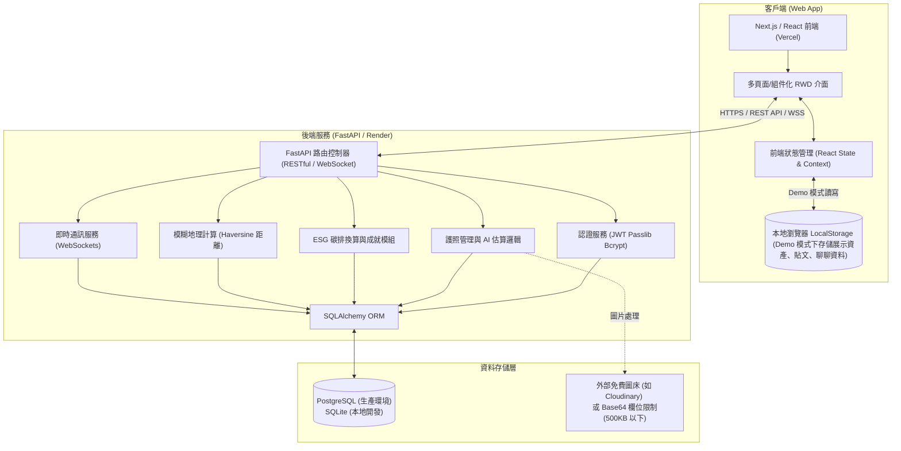
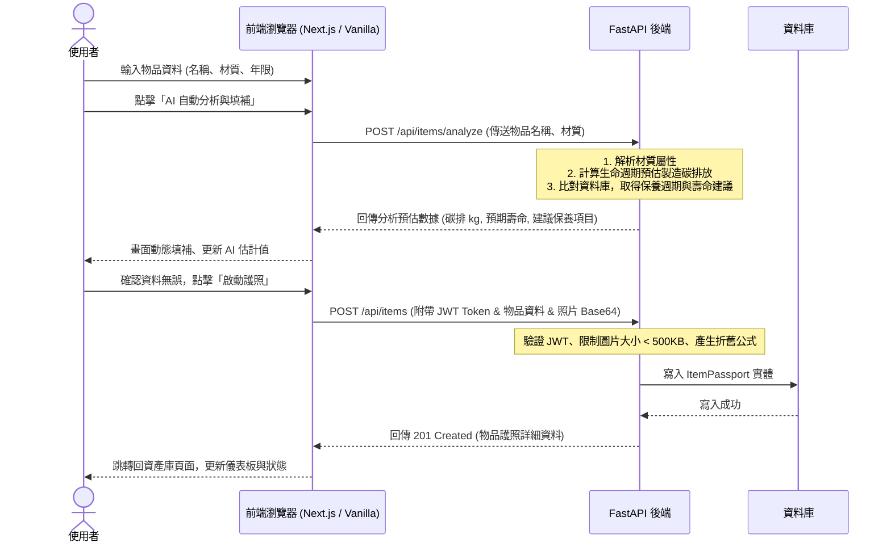
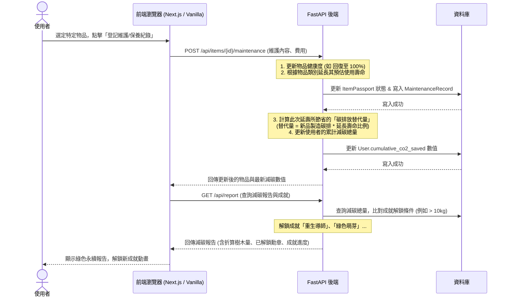
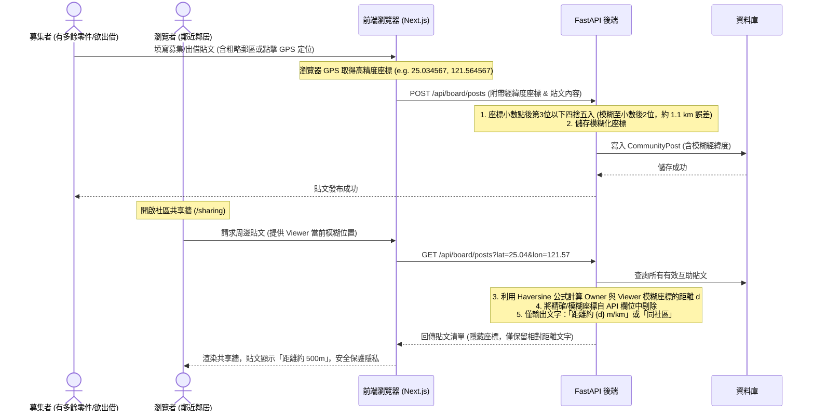
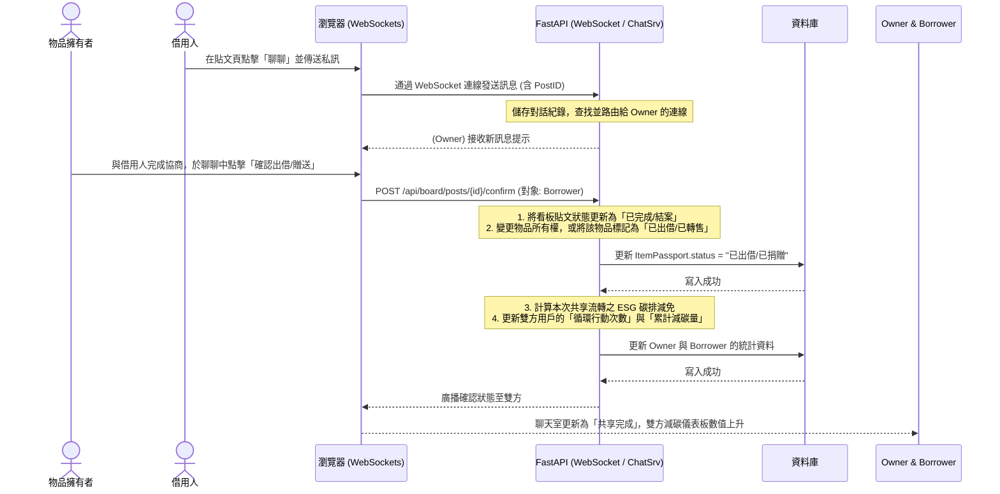
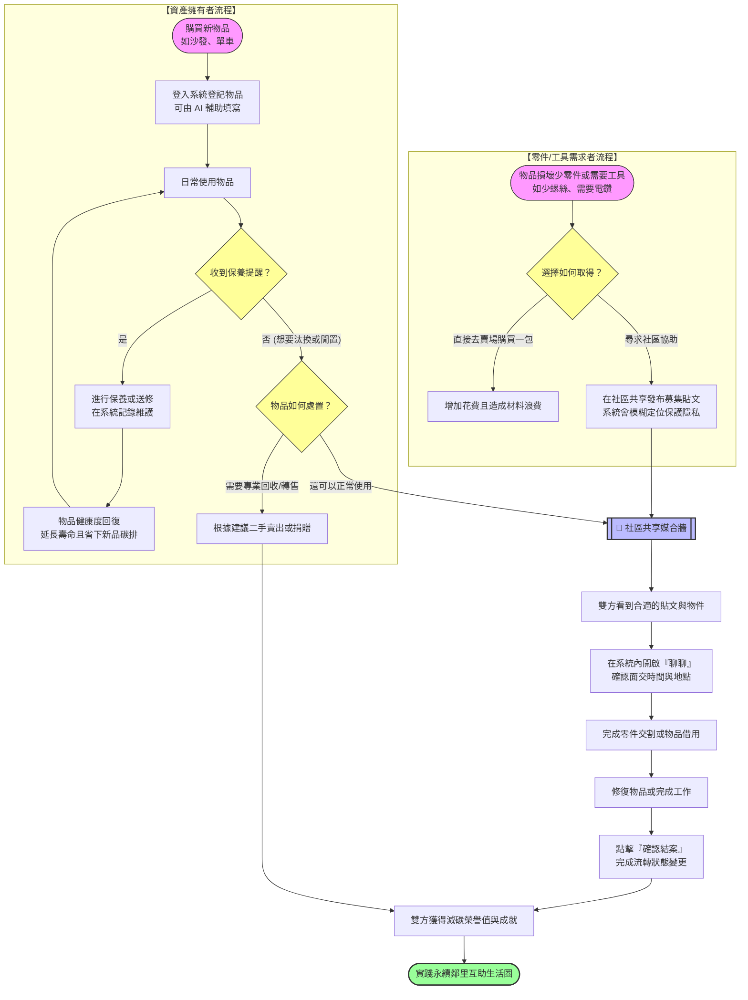

# LifeCycle Passport 系統架構與資料流分析報告

本報告針對 [LifeCycle Passport - 家庭循環資產履歷與 ESG 減碳管家](https://life-cycle-passport.vercel.app/) 的網頁功能、系統架構及資料流進行深度解析，並結合專案本地 `FastAPI` + `Vanilla MPA` 設計，探討在 Demo 階段與正式生產環境中的系統實現。

---

## 1. 網頁功能模組剖析

從線上網頁的結構來看，系統共分為六大核心功能模組：
1. **家庭減碳度量儀表板 (Dashboard)**：統計並展示使用者的資產總量、預期壽命、累計減碳量（kg CO₂）及循環行動次數。
2. **我的資產庫 (Asset Library)**：管理家庭中 3C 家電、家具、交通工具等物品 of 數位履歷（折舊、健康狀態、維護進度），並提供狀態與類別篩選。
3. **啟動新護照 (Register Item)**：登記新物品的基本資料（名稱、材質、年限、購買日），並可點擊「AI 自動分析與填補」以生成預估碳足跡與維護指南。
4. **社區物資共享 (Community Sharing)**：提供鄰里間的零件募集（如單個螺絲）、物品借用與二手贈送。
5. **聊聊 (Chat)**：用戶針對共享物資或互助募集進行點對點即時溝通。
6. **永續減碳報告 (ESG Report)**：將循環行動（保養、維修、捐贈）節省的碳排具體化（如等同種植多少棵樹），並設有「永續成就勳章」解鎖與歷史日誌。

---

## 2. 系統整體架構 (System Architecture)

此系統存在兩種架構層面的實現：
*   **展示模式 (Client-Side LocalStorage)**：即目前的 Vercel 部署版，所有資料直接儲存在瀏覽器 `localStorage` 中，適合無伺服器冷啟動延遲的 Demo 展示。
*   **生產模式 (Full-Stack Client-Server)**：結合 FastAPI 後端與關係型資料庫的標準架構，實現跨裝置同步與社區共享的即時通訊。

### 2.1 系統架構圖 (System Architecture Diagram)

### 架構層次說明：
1.  **客戶端 (Client)**：
    *   **Vercel 部署版**採用 Next.js，支援快速的 UI 渲染與組件化。
    *   **本機開發版**採用極簡的 Vanilla MPA (HTML/CSS/JS)，以靜態目錄託管於 FastAPI 下，降低維護門檻。
2.  **本地存儲 (LocalStorage)**：在 Demo 模式下，載入展示資料與重置均在客戶端完成，不依賴後端。
3.  **後端服務 (FastAPI)**：負責邏輯與資料庫互動。
4.  **資料存儲**：SQLite 用於本地輕量開發，PostgreSQL 用於正式上線。圖片因資料庫容量限制採用 Base64 格式 (限 500KB 以下) 或外部免費圖床。

---

## 3. 核心業務資料流 (Data Flows)

### 3.1 物品護照登記與 AI 碳排評估資料流

當使用者在 `/register` 頁面登記新物品並請求 AI 分析時，資料流向如下：

---

### 3.2 循環行動（維修、保養）與 ESG 報告更新資料流

使用者對物品進行保養或維修，以延長壽命並即時更新永續減碳報告：

---

### 3.3 社區物資共享與位置隱私模糊化資料流

看板共享時，必須保障使用者精確住址隱私，距離計算採後端 Haversine 計算，API 模糊化傳遞：

---

### 3.4 即時聊聊與共享確認資料流

鄰里雙方透過聊聊協商，並在確認出借或贈送後，自動轉換物品履歷：

---

## 4. 系統安全與隱私防護設計

網頁與後端系統在設計上納入了幾項關鍵的資訊安全與隱私防護措施：

1.  **位置隱私防護 (Location Obfuscation)**：
    *   *機制*：前端利用 HTML5 Geolocation API 取得精確 GPS，但在 API 發送或後端接收時，經緯度一律被模糊化至小數點後兩位（誤差約 1.1 公里），且資料庫**不儲存精確座標與詳細地址**。
    *   *傳輸安全*：API 輸出給大眾瀏覽時，徹底移除所有經緯度欄位，僅返回計算後的相對距離文字（例如：「距離 300 公尺」、「距離 1.2 公里」），防止逆向定位攻擊。
2.  **圖片上傳限制 (Base64 Ephemeral Storage)**：
    *   *機制*：為防止資料庫爆滿，上傳圖片限制在 500KB 以下，前端進行壓縮後以 Base64 字串傳送，並存放在關係型資料庫的 TEXT 欄位中，免去了複雜的外部物件存儲設定，又保證了在 Vercel/Render 免費硬碟重啟時資料不丟失。
3.  **無狀態認證 (Stateless JWT)**：
    *   *機制*：用戶密碼採用 `bcrypt` 單向雜湊加密存儲。認證使用 JWT，客戶端登入後將 Token 存於 `localStorage`，隨後的 API 請求於 Header 攜帶 `Authorization: Bearer <JWT>`，降低伺服器 Session 的維護負擔。

---

## 5. 一般使用者操作流程圖 (User Operations Flow)

本章節提供適合一般使用者（非技術人員）理解的整合性操作流程。本圖展示了「資產擁有者」與「物資需求者」如何透過「社區共享媒合牆」產生交集，完成資源流轉並共同實踐綠色生活的完整閉環。

